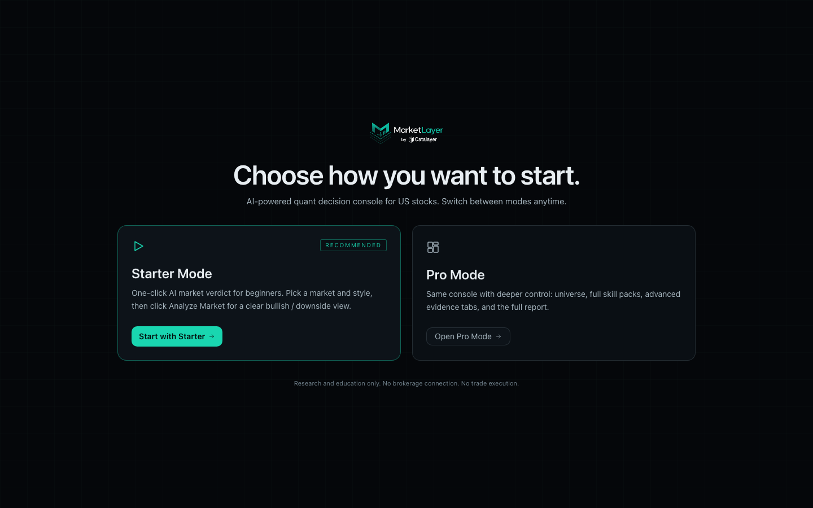
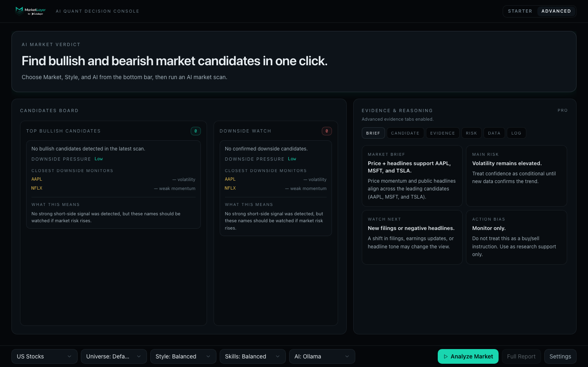
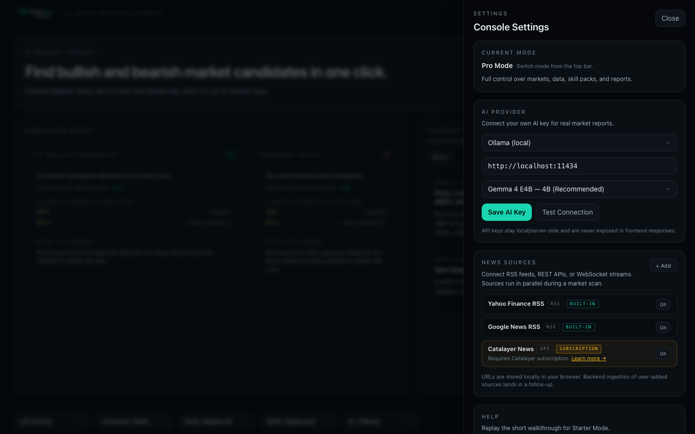
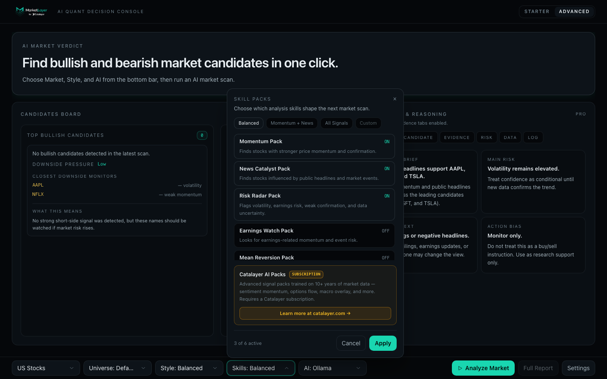

# MarketLayer by Catalayer

### AI Quant Decision Console for US Stock Market Research


**MarketLayer by Catalayer is an open-source AI market research console for US stocks. Bring your own AI provider or run fully locally with Ollama. Research only — no brokerage connection, no trading execution.**

> ⚠️ **Research & Education Only** — MarketLayer does not provide financial advice, trading signals, brokerage services, portfolio management, or buy/sell instructions. It is research and education software. Scan results are AI-generated output based on public data and are not investment recommendations. Users are solely responsible for their own financial decisions.

---


---

## What is MarketLayer?

MarketLayer is an open-source, AI-assisted market research console for US equities. It connects real public data sources — live price feeds, news headlines, and SEC filings — with a skill-pack scoring system and your own AI provider to generate a structured, plain-English market research summary.

Most quant tools require you to already understand indicators, scoring weights, backtesting, signal pipelines, and risk models. MarketLayer starts from the opposite direction. You pick a market. You pick a scan style. You click **Analyze Market**. MarketLayer fetches real public data, runs skill-pack scoring, and asks your AI to explain what it found.

There are no black-box predictions, no hardcoded verdicts, and no synthetic market data. Every result flows from real public sources through transparent scoring logic and your AI provider. If a data source fails, MarketLayer returns an empty result for that source rather than substituting fake data.

MarketLayer is not a trading bot, a signal service, or a portfolio manager. It is a research tool that helps you understand what public data says about a set of stocks — formatted for readability, not for automated execution.

---

## Built by Catalayer

MarketLayer by Catalayer is built by [Catalayer](https://catalayer.com) and follows the Catalayer product direction. It is published as an independent open-source release under the Apache 2.0 license.

MarketLayer is built by Catalayer and follows the Catalayer product direction, but this open-source repository is independently runnable without any Catalayer private services.

**What IS included in this repository:**

- Complete Starter Mode and Advanced Mode UI (React 18 + TypeScript)
- FastAPI backend with all public data connectors
- All skill packs: Momentum, News Catalyst, Risk Radar, Earnings Watch, Mean Reversion, Sector Rotation
- OpenAI, Anthropic (Claude), Gemini, and Ollama provider integrations
- OpenAI-compatible custom endpoint support for any compatible cloud or self-hosted model
- Catalayer AI, Catalayer News, and Catalayer AI Packs as optional integration stubs (UI + placeholder, no private backend code)
- Full security audit report and open-source boundary documentation

**What is NOT included:**

- Catalayer API key generation, account management, billing, or quota logic
- Catalayer private scoring rubrics, model weights, or training datasets
- Catalayer internal news aggregation pipeline
- Catalayer production auth middleware or private API secrets

**Catalayer AI keys are issued only by Catalayer and are not generated, stored, or distributed by this repository.** You can run MarketLayer fully and independently using Ollama (free, local), OpenAI, Anthropic, or Gemini — no Catalayer account required.

---

## Screenshots

| Screenshot | Description |
|---|---|
|  | Mode selection — choose Starter or Advanced on first launch |
|  | Starter Mode — one-click scan with bullish and bearish candidates |
|  | Advanced Mode — full control over universe, skill packs, and risk filters |
|  | Settings drawer — configure your AI provider and news sources |
|  | Skill Packs picker — enable built-in packs or add Catalayer AI Packs |
|  | Full Report modal — complete scan output with all data tabs |

---

## Two modes, one console

### Starter Mode

Starter Mode is the one-click experience. Everything is preset. Pick a market, choose a scan style, connect an AI provider, and click **Analyze Market**.

- **Market**: US Stocks (v0.1)
- **Scan styles**: Balanced · Aggressive · Defensive · News Catalyst
- **Skill Packs**: Momentum · News Catalyst · Risk Radar · Earnings Watch · Mean Reversion · Sector Rotation
- **Output**: Bullish watch candidates · Bearish/downside candidates · AI market brief · Risk alerts · Evidence & Reasoning panel

No scoring weights to configure. No prompts to write. No data pipelines to set up.

### Advanced Mode

Advanced Mode exposes the same scan pipeline with every control unlocked:

- Custom ticker universe
- Per-pack skill selection and combination
- Risk filter inspection and override
- AI provider live configuration
- System log and full scan trace
- Full Report drawer with all data tabs

Advanced Mode is not a separate product. It is the same pipeline with the hood open.

---

## How the scan pipeline works

1. **Universe loading** — load the configured ticker universe (default 10 major US stocks)
2. **Price data** — fetch real live prices from Stooq with yfinance fallback
3. **News headlines** — pull real headlines from Yahoo Finance RSS and Google News RSS
4. **Filing metadata** — retrieve recent 10-K, 10-Q, and 8-K metadata from SEC EDGAR
5. **Skill pack evaluation** — score each ticker against the enabled skill packs using rule-based logic
6. **Candidate ranking** — rank bullish and bearish candidates by composite score
7. **AI enrichment** — send ranked candidates, headlines, and filing data to your AI provider; receive plain-English reasons, a market brief, and risk commentary

> **Safe failure:** if any data source fails, MarketLayer returns an empty result for that source. It never injects synthetic data to fill gaps. If no AI provider is configured, the scan halts with a clear setup-required error (HTTP 422) rather than generating a fake report.

---

## Quickstart

### Requirements

- Python 3.11+
- Node.js 18+
- An AI provider (choose one):
  - [Ollama](https://ollama.com) — free, fully local, no API key required
  - OpenAI API key
  - Anthropic API key
  - Google Gemini API key
  - Any OpenAI-compatible endpoint

### Clone

```bash
git clone https://github.com/stephenywilson/MarketLayer.git
cd marketlayer
```

### Backend

```bash
cd backend
cp .env.example .env          # edit with your AI provider settings
pip install -r requirements.txt
uvicorn app.main:app --host 127.0.0.1 --port 8000 --reload
```

### Frontend

```bash
cd frontend
npm install
npm run dev
```

### Connect your AI provider

Open **Settings** in the app (gear icon, bottom right) and select your AI provider. Or configure via `.env`:

```bash
# Ollama (local, no API key)
AI_PROVIDER=ollama
OLLAMA_BASE_URL=http://localhost:11434
OLLAMA_MODEL=gemma4:e4b

# OpenAI
AI_PROVIDER=openai
OPENAI_API_KEY=your-key-here
OPENAI_MODEL=gpt-4o-mini

# Anthropic
AI_PROVIDER=anthropic
ANTHROPIC_API_KEY=your-key-here
ANTHROPIC_MODEL=claude-3-5-haiku-20241022

# Gemini
AI_PROVIDER=gemini
GEMINI_API_KEY=your-key-here
GEMINI_MODEL=gemini-1.5-flash
```

### Open browser

```
http://localhost:5173
```

---

## AI Providers

| Provider | Requires key | Local | Notes |
|---|---|---|---|
| **Ollama** | No | Yes | Recommended for local use. Run `ollama pull gemma4:e4b`. Any Ollama-supported model works. |
| **OpenAI** | Yes | No | GPT-4o, GPT-4o-mini, or any OpenAI chat model. Configure base URL for OpenAI-compatible services. |
| **Anthropic (Claude)** | Yes | No | Claude 3.5 Haiku recommended for speed; Claude 3.5 Sonnet for quality. |
| **Gemini** | Yes | No | Gemini 1.5 Flash or Pro. API key from Google AI Studio. |
| **OpenAI-compatible** | Yes/Optional | Optional | Together, Groq, Fireworks, DeepInfra, local vLLM, or any endpoint with OpenAI-style chat API. |
| **Catalayer AI** | Catalayer subscription | No | Optional subscription provider. Keys issued only by [catalayer.com](https://catalayer.com). Not generated by this repo. |

API keys are stored in memory only on the backend. They are never written to disk and are never sent anywhere except your chosen provider's API endpoint. Keys are cleared on backend restart.

---

## News Sources

| Source | Type | API key | Notes |
|---|---|---|---|
| Yahoo Finance RSS | News headlines | None | Real public RSS feed |
| Google News RSS | News headlines | None | Real public RSS feed |
| SEC EDGAR | Filing metadata | None | US government public API |
| Catalayer News | Curated financial news | Catalayer subscription | Optional. Subscription required. Keys from [catalayer.com](https://catalayer.com). |

If a news source fails or returns no results, MarketLayer returns an empty list for that source. No synthetic headlines are injected.

---

## Skill Packs

Six skill packs are built into this open-source release:

| Skill Pack | What it measures |
|---|---|
| **Momentum** | Price momentum strength and trend confirmation via moving averages and recent trajectory |
| **News Catalyst** | Headline sentiment, event-driven signal density, and catalyst recency |
| **Risk Radar** | Volatility flags, weak confirmation signals, data-quality risk, and downside monitoring |
| **Earnings Watch** | Earnings-related momentum, event proximity risk, and earnings surprise signal |
| **Mean Reversion** | Extended names that may revert toward recent price ranges |
| **Sector Rotation** | Sector-level strength and cross-stock co-movement signals |

Each skill pack contributes a score, a confidence level, and context text to the AI enrichment step. The AI receives all pack outputs and generates its reasoning from the combined signal.

**Catalayer AI Packs** — optional subscription add-on. Advanced signal packs trained on 10+ years of market data. Available separately at [catalayer.com](https://catalayer.com). The open-source repo includes the UI stub and subscription prompt only.

---

## Open-core boundary

MarketLayer is **open-core** software. The core product is fully open-source and functional without any Catalayer services.

**Included in this repository (Apache 2.0):**

- Full Starter Mode and Advanced Mode UI
- FastAPI backend and all public data connectors
- All six built-in skill packs
- OpenAI, Anthropic, Gemini, Ollama, and OpenAI-compatible provider integrations
- Catalayer AI / Catalayer News / Catalayer AI Packs as integration stubs (UI + endpoint forwarding stub only)
- Complete documentation and security audit

**Not included (Catalayer private infrastructure):**

- Catalayer API key generation and validation
- Catalayer account management and billing
- Catalayer quota enforcement and rate limiting
- Catalayer private scoring rubrics and model weights
- Catalayer private training datasets
- Catalayer internal news aggregation pipeline
- Catalayer production auth middleware and secrets

For full detail, see [OPEN_SOURCE_BOUNDARY.md](OPEN_SOURCE_BOUNDARY.md).

---

## Security

Key security properties of this codebase:

- API keys are stored **in memory only** — never written to disk
- No `.env` files committed (covered by `.gitignore`)
- No hardcoded Catalayer production keys anywhere in the repo
- SSRF protection on user-configurable base URLs
- Ticker symbol input validation (regex, no injection)
- No `dangerouslySetInnerHTML` in the frontend
- CORS restricted to required methods and headers only
- Mock provider (`source="mock"`) blocked in the production scan flow

See [SECURITY.md](SECURITY.md) for the full security policy and how to report vulnerabilities.

See [SECURITY_AUDIT_REPORT.md](SECURITY_AUDIT_REPORT.md) for the pre-release security audit results.

---

## Configuration

Copy and edit the backend environment file:

```bash
cd backend
cp .env.example .env
```

Key configuration options in `.env.example`:

| Variable | Required | Description |
|---|---|---|
| `AI_PROVIDER` | Yes | Active AI provider (`ollama`, `openai`, `anthropic`, `gemini`, `catalayer`, `mock`) |
| `OLLAMA_BASE_URL` | If using Ollama | Default: `http://localhost:11434` |
| `OLLAMA_MODEL` | If using Ollama | Default: `gemma4:e4b` |
| `OPENAI_API_KEY` | If using OpenAI | Your OpenAI API key |
| `OPENAI_BASE_URL` | Optional | Override for OpenAI-compatible endpoints |
| `OPENAI_MODEL` | Optional | Default: `gpt-4o-mini` |
| `ANTHROPIC_API_KEY` | If using Anthropic | Your Anthropic API key |
| `ANTHROPIC_MODEL` | Optional | Default: `claude-3-5-haiku-20241022` |
| `GEMINI_API_KEY` | If using Gemini | Your Gemini API key |
| `GEMINI_MODEL` | Optional | Default: `gemini-1.5-flash` |
| `CATALAYER_API_KEY` | If using Catalayer AI | Issued only by catalayer.com |
| `ALLOWED_ORIGINS` | Optional | CORS origin allowlist |

Never commit your `.env` file to version control.

---

## Contributing

Open an issue to discuss new features, bug reports, or provider integrations before submitting a pull request.

Please do not include API keys, `.env` files, credentials, or Catalayer-branded private assets in pull requests.

---

## License

Apache License 2.0 — see [LICENSE](LICENSE).

Catalayer brand assets, logos, private API infrastructure, proprietary model weights, and private datasets are **not** covered by this license and remain the property of Catalayer.

© 2024–2026 Catalayer AI. MarketLayer is part of the Catalayer AI open-source ecosystem.

---

## Disclaimer

MarketLayer is for **research and educational purposes only**.

It does not provide personalized financial advice, direct market action instructions, brokerage services, portfolio management, or trade execution. Scan results are AI-generated research output derived from public data. They are not investment recommendations and should not be treated as such.

Past market patterns identified by skill packs do not predict future results. Users are solely responsible for their own financial decisions. Always consult a licensed financial advisor before making investment decisions.
